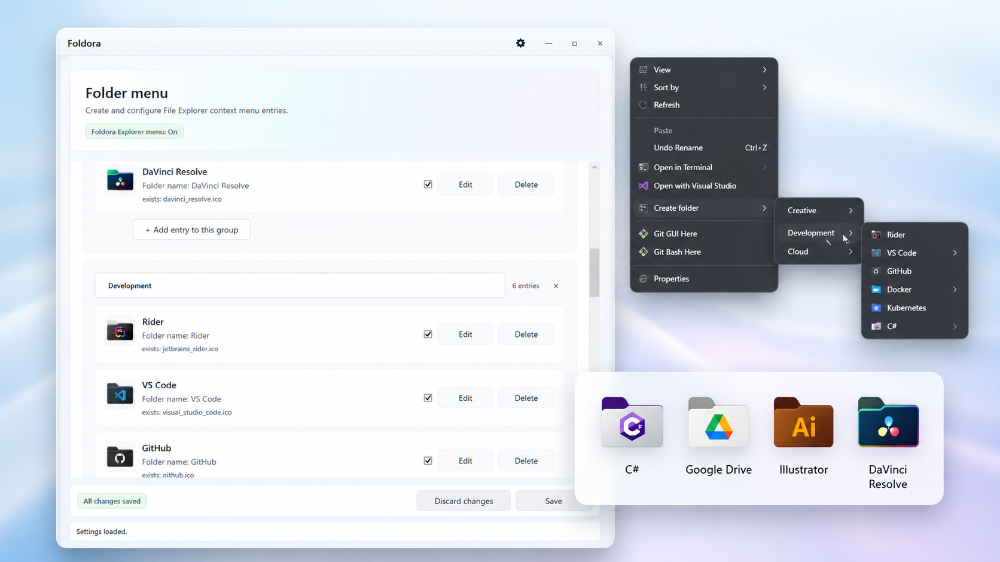

# Foldora

Custom folder creation menu for Windows Explorer.

Foldora lets you build your own "Create folder" menu in File Explorer: choose an `.ico`, name the menu item, set the created folder name, and create styled folders directly from the context menu.

<p align="center">
  
</p>

## Highlights

- Create custom-icon folders from File Explorer.
- Build your own grouped "Create folder" menu.
- Use any valid `.ico` file.
- Preview icons before saving.
- Organize entries with one-level groups.
- Install for the current user, no admin required.
- No background service, tray app, global hook, Explorer patch or system DLL modification.
- 20+ UI languages.
- Existing folders use `desktop.ini`.
- Foldora-owned HKCU registry keys only.

## Quick Start

1. Build and install for the current user:

```powershell
pwsh scripts/install-user.ps1
```

2. Run the app:

```powershell
& "$env:LOCALAPPDATA\Programs\Foldora\Foldora.App.exe"
```

3. Add menu entries, choose `.ico` files, set created folder names and save changes.

4. Open Settings and enable the Explorer menu.

5. In File Explorer, use the legacy context menu:

```text
Right-click -> Show more options -> Create folder
```

Depending on Windows 11 shell behavior, the Foldora menu may appear under `Show more options`.

## Example Menu

```text
Create folder
  Colors
    Blue
    Red
  Work
    Documents
  Media
    Music
    Pictures
```

Selecting an entry creates a folder and applies its icon through `desktop.ini`.

## Current Capabilities

- WPF editor for menu entries.
- Compact/edit cards for entries and groups.
- Add/remove menu entries.
- One-level grouping through `GroupName`.
- User-editable menu title, entry label, created folder name and enabled state.
- Staged save: changes are not written until `Save`.
- `.ico` import into `%AppData%\Foldora\icons\`.
- Direct `.ico` preview in the WPF editor.
- Self-authored Foldora app/window/exe icon.
- Safe HKCU legacy context menu registration under Foldora-owned roots.
- No-console `Foldora.MenuHost.exe` for Explorer menu commands.
- Small icons in the legacy Explorer menu.
- Folder creation with a custom icon through `desktop.ini`.
- Best-effort desktop icon placement for folders created from the desktop background legacy menu.
- Settings window for language, Explorer menu integration, installation paths, Help/About and reset.
- Help/About window with basic workflow and safety notes.
- Per-user install and uninstall scripts under `%LocalAppData%\Programs\Foldora`.
- Unregister flow that disables Explorer integration without deleting entries.
- Reset flow that clears the user menu and disables Explorer integration.

## Requirements

To run an installed or framework-dependent build:

- Windows 11.
- .NET 10 Windows Desktop Runtime, unless a future build is published self-contained.
- Explorer legacy context menu support.

To build from source:

- Windows 11.
- .NET SDK 10.x.
- PowerShell 7 is recommended for the documented local workflow.
- Git is needed only for working with the repository.

Foldora uses HKCU registry keys only for Explorer integration and does not require administrator rights.

Windows 10 and non-Windows platforms are not claimed as supported for the current MVP.

## Install For Current User

```powershell
pwsh scripts/install-user.ps1
```

The script refreshes the dev publish output and copies binaries to:

```text
%LocalAppData%\Programs\Foldora\
%LocalAppData%\Programs\Foldora\Foldora.App.exe
%LocalAppData%\Programs\Foldora\Foldora.Cli.exe
%LocalAppData%\Programs\Foldora\Foldora.MenuHost.exe
```

It does not require admin rights, does not register Explorer integration and does not start the app. After install, run `%LocalAppData%\Programs\Foldora\Foldora.App.exe` and enable Explorer integration from Settings.

`Foldora.MenuHost.exe` is not a service, tray app, background helper or autostart process. It is a short-lived no-console executable launched by Explorer only when the user clicks a Foldora context-menu command.

## Uninstall

To unregister the menu and remove installed binaries:

```powershell
pwsh scripts/uninstall-user.ps1
```

By default this keeps:

```text
%AppData%\Foldora\
```

That preserves settings, imported icons and logs. This matters because already styled folders can have `desktop.ini` entries that reference imported `.ico` files under `%AppData%\Foldora\icons`.

Optional full user-data removal:

```powershell
pwsh scripts/uninstall-user.ps1 -RemoveUserData
```

Use `-RemoveUserData` only when you intentionally want to delete settings, imported icons and logs; existing styled folders can lose their custom icons.

## Development Run

```powershell
dotnet restore Foldora.sln
dotnet build Foldora.sln
dotnet test Foldora.sln
dotnet run --project src/Foldora.App/Foldora.App.csproj
```

The project currently targets .NET 10. Do not retarget it to .NET 8 for this repository state.

## Dev Publish

For repeatable manual Explorer testing without an installer:

```powershell
pwsh scripts/publish-dev.ps1
```

The script publishes framework-dependent Release builds into:

```text
artifacts/publish/Foldora/
artifacts/publish/Foldora/Foldora.App.exe
artifacts/publish/Foldora/Foldora.Cli.exe
artifacts/publish/Foldora/Foldora.MenuHost.exe
```

The script does not register the Explorer menu and does not start the app. A published build requires the .NET 10 Windows Desktop Runtime unless a future self-contained publish mode is added.

When testing this layout, Explorer integration should point to the published sibling MenuHost. If you enable Explorer integration from `artifacts/publish/Foldora/Foldora.App.exe`, the WPF app resolves `Foldora.MenuHost.exe` from the same publish folder.

## Basic CLI Example

After building or publishing, use the CLI executable for manual commands:

```powershell
foldora menu add --icon "<path-to-documents.ico>" --name "Documents" --folder-name "Documents" --group "Work"
foldora menu add --icon "<path-to-music.ico>" --name "Music" --folder-name "Music" --group "Media"
foldora register-menu --host-path "<path-to-Foldora.MenuHost.exe>"
foldora unregister-menu
```

`Foldora.Cli.exe` is a console tool for manual commands and diagnostics. Explorer context menu commands should use `Foldora.MenuHost.exe`.

## Data Locations

Foldora stores user data under:

```text
%AppData%\Foldora\
%AppData%\Foldora\settings.json
%AppData%\Foldora\icons\
%AppData%\Foldora\previews\
%AppData%\Foldora\packs\
```

Imported icons are copied into the `icons` directory. The original source icon file is not used as the permanent menu icon path.

Per-user installed binaries live separately under:

```text
%LocalAppData%\Programs\Foldora\
```

Uninstall keeps `%AppData%\Foldora` by default because existing styled folders can reference imported icons from `%AppData%\Foldora\icons`.

## Localization

Foldora has complete enabled WPF UI catalogs for:

```text
bg, cs, de, en, es, fr, hi, hu, id, it, ja, ko, nl, pl,
pt-BR, pt-PT, ro, ru, th, tr, uk, vi, zh-Hans, zh-Hant
```

On first WPF launch, Foldora chooses the system UI language only if it is complete and enabled; unsupported system languages fall back to English. The selected language is saved and is not re-detected on later launches.

Changing the application language changes UI labels, status text, the untouched default menu title and defaults for newly created entries. It does not rewrite a custom menu title, entry names, folder names or group names.

## Limitations

Foldora is an early MVP / work-in-progress project. It is usable for local testing through the per-user install script, but it does not have a stable public release flow yet.

- Modern Windows 11 compact context menu integration is not implemented.
- The current Explorer integration uses the legacy context menu, so the menu may appear under `Show more options`.
- Exact original right-click desktop placement is not available from the current legacy-menu MVP. Foldora does a best-effort move of newly created desktop folder icons near the cursor/menu selection position, and Explorer may snap or shift icons according to its grid/layout rules.
- No MSI/MSIX installer yet.
- No Program Files layout, code signing, winget package or stable release packaging yet.
- No icon pack import/export yet.
- No PNG-to-ICO conversion yet.
- No full nested tree storage beyond the current one-level `GroupName`.
- No drag-and-drop ordering or group icons yet.
- No orphan icon cleanup yet.
- No user-facing diagnostics if `Foldora.MenuHost.exe` fails when invoked by Explorer.
- Localization debt remains for CLI diagnostics/validation output, startup fatal errors and external translation review; WPF catalogs are complete for the enabled locales.
- No Explorer restart or icon cache reset flow.

## Safety Disclaimer

Foldora is experimental early MVP software. It is provided as-is, without warranty. The author is not liable for loss, damage, configuration issues, Explorer behavior, shell behavior or other problems caused by use or modification of the software.

Foldora modifies user-level HKCU registry keys only under Foldora-owned paths and creates/edits `desktop.ini` inside folders selected or created by the user. Test on non-critical folders first.

## License

Unless otherwise noted, original Foldora source code, documentation and self-authored project assets are licensed under the Zero-Clause BSD License (0BSD). See [LICENSE](LICENSE).

0BSD applies only to materials whose rights belong to the Foldora author/contributors. Third-party components and assets are not relicensed by Foldora; they remain under their respective licenses and attribution requirements. If a README statement conflicts with a bundled third-party license, the third-party material's own license controls that material.

Русское пояснение: если явно не указано иное, оригинальный код Foldora, документация и созданные автором ресурсы распространяются под 0BSD. Сторонние материалы не перелицензируются автором Foldora; для них действуют их собственные лицензии.

## Third-Party Resources

No third-party runtime visual assets are currently bundled. The Foldora app icon is a self-authored folded blue/cyan folder mark with a broad light-cyan folded plane under 0BSD. The README hero is a maintainer-created presentation mockup/screenshot asset; any third-party trademarks or logos visible inside that mockup remain property of their respective owners and are not provided as reusable Foldora assets. Third-party materials, if added later, are listed in [THIRD_PARTY_NOTICES.md](THIRD_PARTY_NOTICES.md). Resource rules are documented in [docs/RESOURCE_POLICY.md](docs/RESOURCE_POLICY.md).

Free download availability is not enough to include an asset in this repository. Every bundled third-party resource must have an explicit license that allows Foldora's actual use, redistribution and attribution model.

## AI Assistance Note

Parts of Foldora were developed with assistance from OpenAI Codex and other AI tools. Product decisions, architecture decisions, manual verification and commits are reviewed or performed by the maintainer.

AI-assisted development does not change ownership or license requirements for third-party materials. Third-party resources still require explicit license review before they can be added to the repository.

## Documentation

Detailed project documentation starts at [docs/README.md](docs/README.md).

Useful entry points:

- [Current project state](docs/PROJECT_STATE.md)
- [Roadmap](docs/ROADMAP.md)
- [Settings and data model](docs/SETTINGS.md)
- [Shell integration](docs/SHELL_INTEGRATION.md)
- [Localization](docs/LOCALIZATION.md)
- [Resource policy](docs/RESOURCE_POLICY.md)
- [Technical debt](docs/TECH_DEBT.md)
